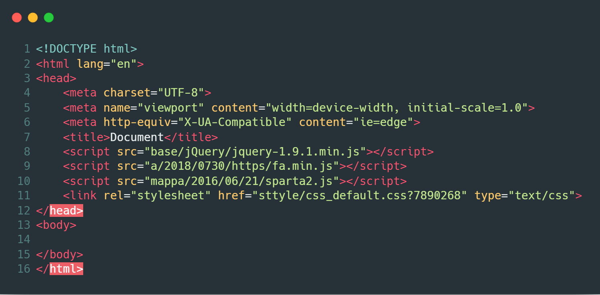
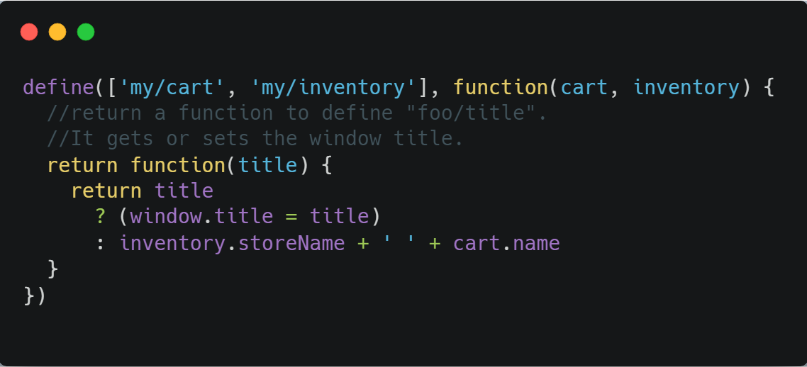
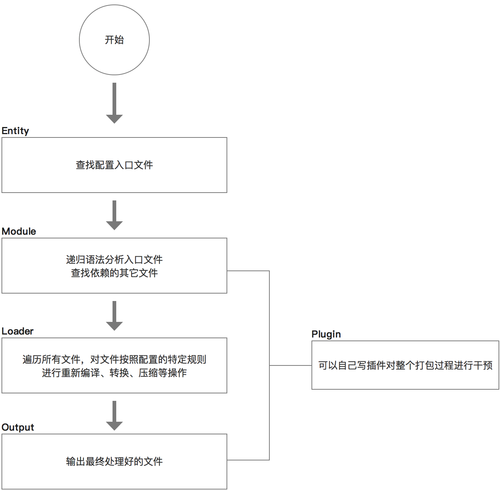

title: Webpack.1 Intro
speaker: yaoj@landicorp.com
plugins:
    - echarts

<slide class="bg-black-blue fullscreen aligncenter" image="https://wallpapers.wallhaven.cc/wallpapers/full/wallhaven-734918.jpg dark">

# webpack.1 intro {.text-landing.text-shadow}

By  yaoj {.text-intro}

</slide>

<slide class="slide-top" image="https://wallpapers.wallhaven.cc/wallpapers/full/wallhaven-110479.jpg">

:::div {.content-right}
## 刀耕火种的年代
## 以叶蔽体，什么都得自己来
:::

</slide>

<slide class="bg-gradient-h aligncenter">

</slide>

<slide image="https://cdn-images-1.medium.com/max/1200/1*-ccpoehy968EMDfBbR_MoQ.png .right">

:::{.content-left}
### 语言模块化

:::flexblock {.specs}
::fa-globe::

## 隔绝对象
使用全局对象，靠自觉来规避显然不可靠

---
::fa-align-left::

## 模块依赖树

形成模块依赖树，决定加载顺序和执行顺序

---
::fa-file::
## 加载方式
如何加载模块文件，是否延续目录结构
:::

<slide class="aligncenter">
## RequireJS

:::column

##### 实现方法 {.vertical-align}

#### 提供JS用作模块加载与解析
#### 运行时判断依赖关系
#### 动态加载JS代码

----

####

!

---

#### Code Demo

:::

<slide class="aligncenter">

::: column

## Browserify

:::flexblock {.specs}

::fa-copy::

## 加入编译

编译时AST分析依赖树，生成依赖树

---
::fa-align-right::

## 合并依赖文件

将依赖文件进行合并，最终生成dist.bundle.js

---
::fa-file::

## 原有文件结构和输出无关

原有目录结构不再与输出相关

:::

<slide class="center">

## Webpack

---

::: column

万物皆资源

---

插件化(Plugin/Loader)

---

预编译

---

devServer

---

HMR

---

Code Split 按需加载

---

<slide class="bg-gradient-v">

## Webpack 基础概念

---

1. *Entry*：入口，Webpack 执行构建的第一步将从 Entry 开始，可抽象成输入。
2. *Module*：模块，在 Webpack 里一切皆模块，一个模块对于着一个文件。Webpack 会从配置的 Entry 开始递归找出所有依赖的模块。
3. *Chunk*：代码块，一个 Chunk 由多个模块组合而成。它是为了做代码管理和分割。
4. *Loader*：模块转换器，用于把模块原内容按照需求转换成新内容。
5. *Plugin*：扩展插件，往 Webpack 构建流程中的特定时机注入扩展逻辑来改变构建结果或做你想要的事情。
6. *Output*：输出结果，在 Webpack 经过一系列处理出最终想要的代码后，如何输出它们。

<slide class="bg-gradient-r aligncenter">

